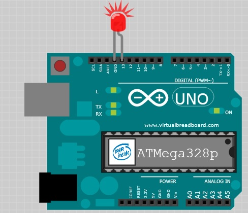

# Membuat LED berkedip

``` c++
// the setup function runs once when you press reset or power the board
void setup() {
  // initialize digital pin LED_BUILTIN as an output.
  pinMode(LED_BUILTIN, OUTPUT);
}

// the loop function runs over and over again forever
void loop() {
  digitalWrite(LED_BUILTIN, HIGH);   // turn the LED on (HIGH is the voltage level)
  delay(100);                       // wait for a second
  digitalWrite(LED_BUILTIN, LOW);    // turn the LED off by making the voltage LOW
  delay(100);                       // wait for a second
}
```

## Fungsi Setup
`Setup` adalah fungsi pertama yang dibaca oleh program **Arduino**, dan fungsi tersebut hanya dijalankan satu kali saja. Tujuan untuk mempersiapkan perangkat **Arduino**, mengisi sebuah nilai atau properti kedalam papan arduino yang nilainya tidak akan berganti selama operasi berlanjut.

## PinMode
`Fungsi `pinMode` mengkonfigurasi pin tertentu untuk masukan (menerima data) atau keluaran (mengirim data). Fungsi ini membutuhkan dua buah parameter.
1. `pin`: Nomor dari pin yang kita ingin atur.
2. `mode`: berisi nilai `INPUT` atau `OUTPUT`.

```
pinMode(LED_BUILTIN, OUTPUT);
```
Berikut adalah implementasi penggunaan fungsi `pinMode` pada contoh **blinK**. `LED_BUILTIN` memberitahu sebuah fungsi kita ingin mengkontrol LED pada papan **Arduino** (yang tidandai dengan tanda **L**) dan menyetelnya mode pin tersebut ke `OUTPUT`.

## Loop
`Loop` adalah sebuah fungsi yang berjalan terus menerus hingga tombol *reset* ditekan atau papan **Arduino** kehilangan tenaga. Berikut adalah penggunaan fungsi `Loop` pada contoh ini.

``` c++
oid loop() {
 digitalWrite(LED_BUILTIN, HIGH); // turn the LED on (HIGH is the voltage level)
 delay(1000); // wait for a second
 digitalWrite(LED_BUILTIN, LOW); // turn the LED off by making the voltage LOW
 delay(1000); // wait for a second
}
```

## DigitalWrite 
fungsi ini berguna untuk mengirim nilai digital ke sebuah pin. Sebagaimana yang telah dibahas sebelumnya, pin digital hanya mengerti dua kondisi; `on` atau `off`. Namun didalam kelistrikan dapat disamakan dengan `HIGH` atau `LOW`.
Papan **Arduino** membutuhkan 5v untuk berjalan yang mana berasal dari sebuah USB atau suplai tenaga dari luar. Nilai `HIGHT` sama dengan `5v` dan `LOW` sama dengan `0V`. Fungsi ini membutuhkan dua parameter.
1. `pin`: Nama dari pin yang ingi diintegrasikan.
2. `value`: Nilainya dapat berupa `HIGHT` atau `LOW`.

Maka fungsi berikut `digitalWrite(LED_BUILTIN, HIGH); ` didalam bahasa inggri memberitahukan `kirim 5v ke papan **Arduino** yang ada LED didalamnya.

## Delay
Fungsi tersebut memberhentikan aktifias diluar rumahnya.

## Blinking Bighter
Lampu LED yang ditandi dengan huruf `L` sebenarnya tersambung sebelum sebelum mencapai pin nomor 13. Papan **Arduino** awalan kita wajib menyediakan lampu LED sendiri (tidak ada lampu LED di papan). Namun kare lampu LED sangat penting dan berguna untuk *debugging* dan *signaling*, sekarang lampu LED ditambahkan secara permanen untuk membatu kita.

Sekarang kita ingin menambahkan lampu LED eksternal kedalam papan Arduino. Jika kita lihat pada gambar lampu LED, kedua kakinya tidak sama, ada yang lebih panjang dan ada yang lebih pendek. Kaki yang lebih panjang dapat dikatakan anoda (+) dan kaki yang lebih pendek adalah `cathode atau nd`. Letakan anoda pada pin 13 dan cathode pada pin GND (ground).



Sebagaimana yang telah dibahas sebelumnya, variabel `LED_BUILTIN` adalah variabel yang telah didefinisikan diawal yang mengacu ke LED pada papan. Karena LED dikendalikan oleh pin no 13, sangat memungkikan untuk mengedalikan komponen lain dengan menghubungkan ke pin no 13. Suplai voltase oleh semua pin dapat terlalu tinggi untuk kebanyakan lampu LED. Untungnya fitur lain dari pin no 13 adalah pin bawaan dan pull-down resistor. Resistor ini menahan LED kita tetap pada tegangan volt yang stabil dan memastika lampu LED memliki umur yang pangjang dalam penggunaanya.


