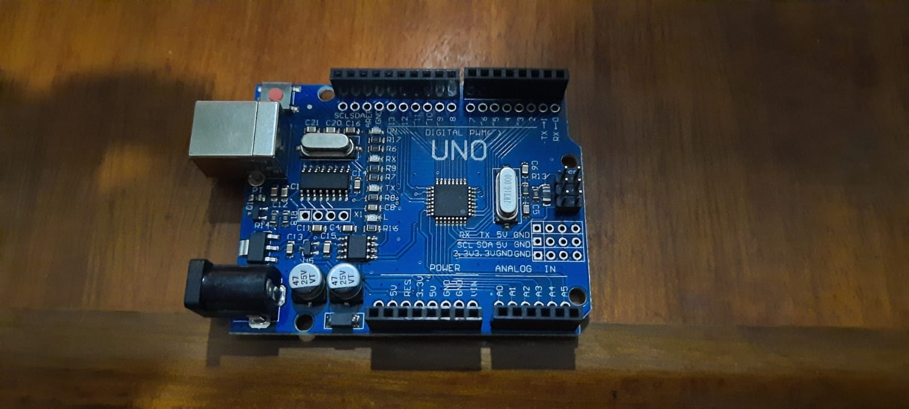
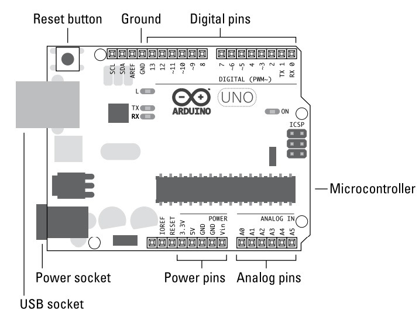

# Mengenal Papan Arduino

## Komponen dari Papan Arduino
### Otak dari Arduino : ATmega328P microcontroller chip

Cip microcontroller adalah otak dari papan Andruino. Cip ini juga dapat disebut dengan *Integrated Circuit* atau IC

### Header sockets
Soket dari microcotroller menghubungkan semua kaki tangan dari cip ATmega328 microcontroller ke soket yang lainnya. Merujuk pada *header socket* yang diatur di sekitar tepi papan dan diberi label untuk kemudahan penggunaan. Soket hitam ini dibagi menjadi tiga kelompok. **digital pins**, **analog input pins**, dan **power pins**. Ketiga *pins* tersebut mentransfer *voltaget*, bisa mentransfer keluar ataupun menerimanya sebagai nilai masukan.

> Mengapa pins ini sangat penting ?

Karena *pins* tersebut membuat kita dapat terhubung dengan cepat dan mudah ke sirkuit tambahan ketika kita membuat prototype dengan breadboard dan untuk mendesain papan tambahan (*shields*).

Proses yang sama ini dari mengirim dan menerima sinyal elektrik seperti yang kita dapati dalam komputer moderen. Namun karena komputer sangat kompleks dan "" dibandingkan dengan sebuah **Arduino** maka sangat sulit untuk secara langsung menghubungkan komputer yang terbiasa dengan digital sinyal (0s dan 1s) ke sirkuit elektronik yang berhubungan dengan rentang tegangan (ov sampai dengan 5v ATmega329P)

Yang membuat Arduino sangat spesial adalah, Arduino dapat menafsirkan (meng interpret) sinyal elektronik dan mengubahnya kedalam sinyal digital yang dapat dipahami oleh komputer. Dan juga dapat menulis sebuah program menggunakan perangkat lunak pada sebuah komputer dimana Arduino IDE mengkonversinya atau mengkompilenya ke sinyal elektrit yang dapat dipahami oleh sirkuit.

### Digital Pins
Berguna untuk mengirim dan menerima sinyal digital. Digital menyiratkan bahwa *pins* memliki dua **pernyataan** : `off` atau `on`. Pada istilah elektornik, **pernyataan** ini di terjemahkan ke sebuah nilai dari `0`atau `5` volts, tidak ada nilai diantaranya.

### Analog in Pins
Berguna untuk menerima nilai analog. Nialai analog didapatkan dari jarak nilai. Pada kasus ini jaraknya sama dengan jarak *Digital Pins*, antara `0V` ke `5V`, namun yang membedekan nilainya bisa diantara jarak nilai tersebut, `0.1, 0.2, 0.3, dan seterusnya.

### Bagaiamana dengan analog out pins ?
Jika dilihat pada papan **Arduino** tidak ada label yang bertuliskan **analog out*. Faktanya **analog out** ada namun tersembunyi diantara [digital pins](#Digital-Pins) yang ditandai dengan `PWM` menggunakan simbil `~`. `PWM` adalah *pulse-width modulation*, yang mana adalah sebuah tekhnik yang dapat kita gunakan untuk memberikan kesan output analog menggunakan digital pin. Pembahasan tentang `PWM` akan dibahasi nanti. Simbol `~` muncuk setelah digital pin `3,5,6,7,10 dan, 11` yang menunjukan kita memliki enam pin yang mampu `PWM`.
