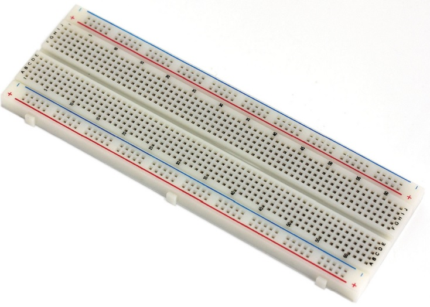
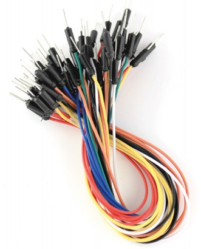
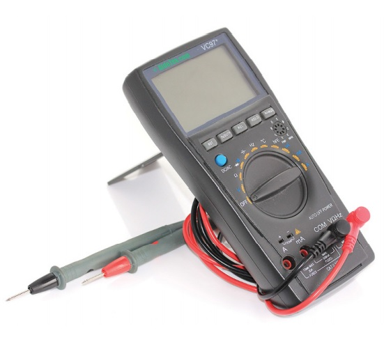

# Membuat LED berkedip
Pada bagian ini kita akan menambah pemahaman tentang prototiping dan bagaimana cara menggunakan alat prototiping pada Arduino. Alat prototipe dapat digunakan untuk membuat sirkuit sementara dalam penambahan komponen baru, menguji sirkuit dan membuat prototipe sederhana. Pada bagian ini kita akan mengenali beberapa perlengkapan dan tekhnik yang dibutuhkan untuk membuat sirkuit dan ide prototipe.

## Alat yang tepa untuk bekerja
Prototiping adalah tentang mengeksplorasi ide-ide, yang mana hal tersebut adalah inti dari Arduino. Meskipun teori sangatlah penting, namun seringkali belajar akan lebih cepat dan efektif dari pengalaman.

Pada seksi ini kita akan mengenali beberapa alat prototiping dan komponen yang dapat digunakan untuk membuat sebuah sirkuit.

1. Breadboard

2. Jump wires

3. Multimeter

## Multimeter untuk menghitung Voltage, Current dan Resistance

### Mengukur voltage pada sirkuit
### Mengukur Current pada sirkuit
### Mengukur resistance pada sirkuit
### Mengukur variabel resistance
### Mengecheck continuity pada sirkuit

